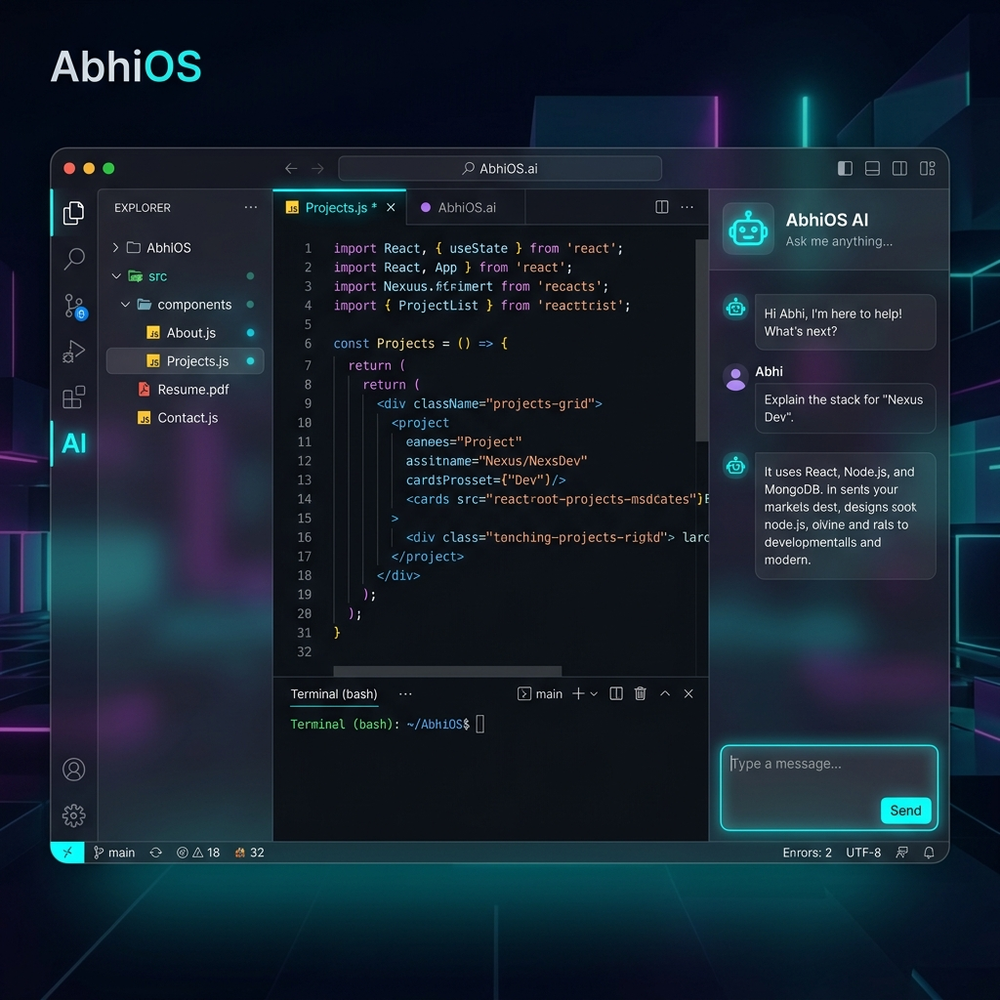

# 🌌 AbhiOS v4.0 — The Ultimate Developer Workspace

<p align="center">
  
</p>

---

## ⚡ Elevating the Digital Portfolio Experience

**AbhiOS** isn't just a portfolio; it's a high-performance **Virtual Development Environment** built to showcase the intersection of design and engineering. It's a living demonstration of modern web capabilities, featuring a fully interactive IDE, a secure AI Copilot, and a lightning-fast terminal.

---

## 🛠️ The Core Engine

| Tech | Role |
| :--- | :--- |
| **React 19** | Modern, high-performance UI rendering |
| **TypeScript** | Type-safe development at scale |
| **Tailwind CSS** | Precision glassmorphism & responsive layouts |
| **Groq / Llama 3.1** | State-of-the-art AI inference |
| **Netlify Functions** | Secure, serverless backend proxying |
| **DOMPurify** | Enterprise-grade content sanitization |

---

## 🚀 System Capabilities

### 🖥️ Interactive IDE Workspace
A pixel-perfect recreation of a modern code editor. Experience real-time file exploration, tabbed navigation, and a focus-driven UI that feels alive.

### 🤖 Integrated AI Copilot
Powered by **Llama 3.1-8b-instant** on **Groq Cloud**. Ask anything about my professional journey, technical expertise, or project architecture.
> **Security First**: All AI interactions are proxied via serverless functions to keep secrets internal.

### 🐚 Hyper-Responsive Terminal
A functional CLI integration for those who prefer the speed of the terminal. Run commands, explore the system, and interact with the kernel in real-time.

### 🧱 Hardened Security
- **Serverless Proxies**: Sensitive API keys never touch the client.
- **IP Rate Limiting**: Intelligent abuse prevention at the edge.
- **XSS Guardian**: Every AI response is sanitized via DOMPurify before rendering.

---

## 📦 Installation Routine

Fuel up your local environment in minutes:

```bash
# Clone the OS
git clone https://github.com/abhisheksinha20p/Portfolio.git

# Navigate to core
cd Portfolio

# Install system dependencies
npm install

# Initialize local dev server
npm run dev
```

---

## ☁️ Cloud Deployment

Optimized for **Netlify Edge** deployment.

1. **Connect Repo**: Pair your branch with Netlify.
2. **Global Variables**: Inject `GROQ_API_KEY` into the Netlify Dashboard Environment (keep it secret, keep it safe).
3. **Execution**: Netlify handles the rest, deploying `dist` to the global CDN and initializing serverless handlers in `netlify/functions`.

---

## 🛰️ Navigation Matrix

- `src/layout/`: The structural backbone of the IDE.
- `src/sections/`: High-fidelity project & experience artboards.
- `src/lib/ai.ts`: The secure bridge to the AI kernel.
- `netlify/functions/`: Server-side intelligence & rate-control logic.

---

<p align="center">
  Built with ☕ and 💖 by <b>Abhishek Sinha</b>
</p>
